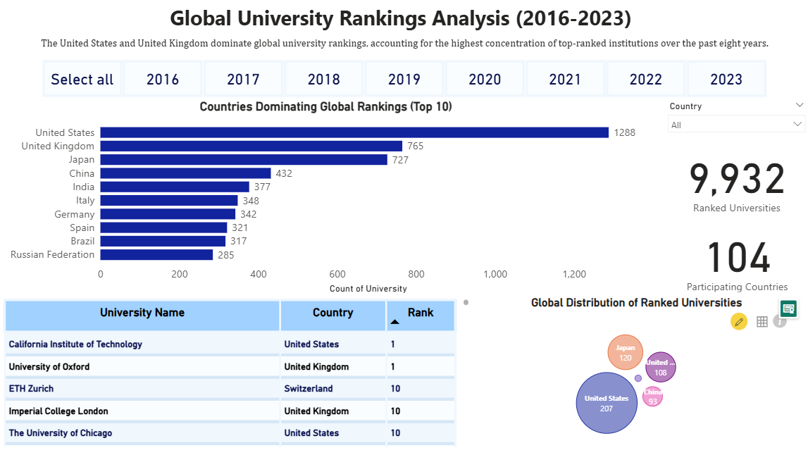
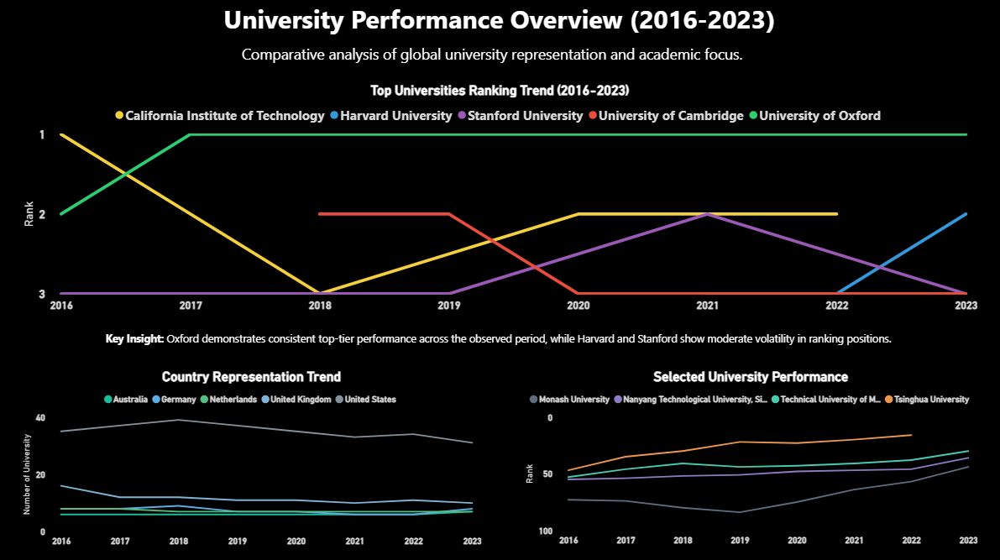
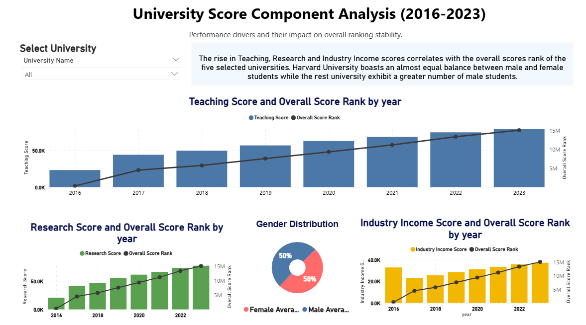
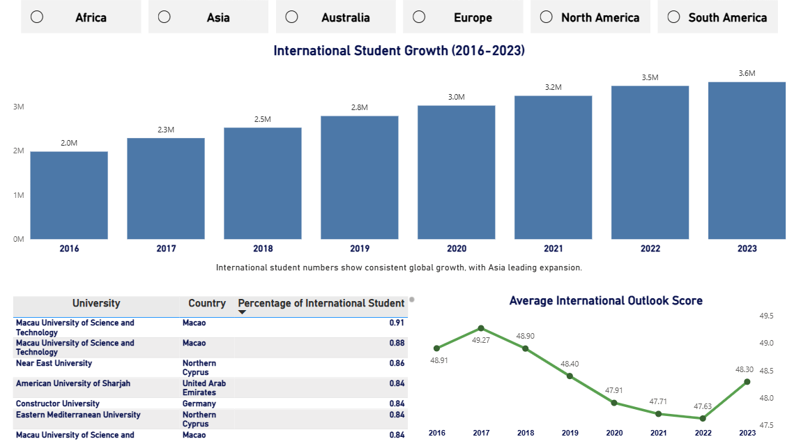

# World University Ranking Dashboard – Data Analysis & Visualization

👩‍💻 Nur Aina Aqiela  
🎓 Master of Science in Applied Mathematics  

---

## 📊 Project Overview

This project presents a multi-page interactive Power BI dashboard analyzing global university performance trends from 2016 to 2023.

The dashboard delivers structured insights into:

- Global university ranking movements  
- Teaching, Research, and Industry score components  
- Gender distribution analysis  
- International student growth patterns  
- International outlook score trends  

The dashboard design follows executive-style data visualization principles with structured layout, consistent color discipline, and clear analytical storytelling.

---

## 📌 Key Results

✔ Identified steady global growth in international student numbers (2016–2023)  
✔ Observed strong correlation between Teaching & Research scores and overall ranking stability  
✔ Analyzed Industry Income contribution trends over time  
✔ Highlighted regional variation in international outlook performance  
✔ Applied professional dashboard design standards and visual hierarchy  

---

## 🛠 Tools & Technologies

- Power BI Desktop  
- DAX (Data Analysis Expressions)  
- Data Cleaning & Transformation  
- Data Modeling  
- Dashboard Design & Data Storytelling  

---

## 📁 Repository Files

- World_University_Ranking.pbix  
- Dashboard preview images  
- README.md  

---

## 📷 Dashboard Preview

(Replace filenames below with your EXACT image names if different)

---

## 🚀 How to Use

1. Download the .pbix file  
2. Open using Microsoft Power BI Desktop  
3. Interact with slicers and visuals to explore insights  

---

## 📈 Project Status

✅ Completed  
📌 Portfolio Project  

---

## 📬 Connect

If you found this project interesting, feel free to connect with me on LinkedIn or explore my other analytics projects.
